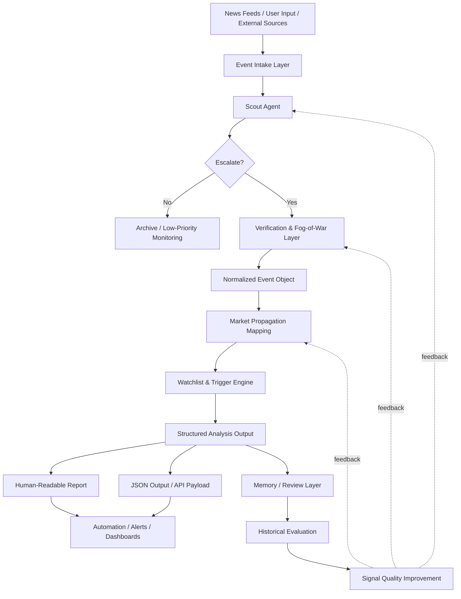

<p align="center">
  
</p>

<h1 align="center">Geo Market Watch 🌍📈</h1>

<p align="center">
  <strong>An LLM-native framework for translating geopolitical events into structured market intelligence.</strong>
</p>

Geo Market Watch converts complex geopolitical developments into structured market observations by combining event normalization, propagation mapping, and trigger-based watchlists.

Instead of producing narrative commentary, the framework focuses on **actionable structure**:

- confirmed facts
- market interpretation
- scenario analysis
- structured watchlists
- observable triggers
- explicit invalidation conditions

The project is designed for analysts, researchers, and developers who want to build **event-driven market intelligence systems** powered by LLMs.

---

# ⚠️ Repository Scope

This repository provides:

- an analytical framework
- structured output schemas
- validation tooling
- workflow examples

It **does not include a built-in monitoring backend or scheduler**.

The framework is intended to be embedded into automation platforms such as:

- workflow orchestration tools
- agent frameworks
- research pipelines
- internal analytics systems

See [docs/scheduled-monitoring.md](docs/scheduled-monitoring.md) for integration examples.

---

# Why Geo Market Watch?

Most geopolitical analysis tools focus on **text generation**.

Geo Market Watch focuses on **structured intelligence generation**.

Instead of producing commentary like:

> "Tensions in the region may affect markets."

The framework produces structured outputs such as:

```
Event
↓
Market Interpretation
↓
Propagation Chain
↓
Watchlist
↓
Trigger Signals
↓
Invalidation Conditions
```

This allows outputs to be used by:

- research teams
- trading workflows
- automated monitoring systems
- dashboards and alerts

---

## System Architecture

The framework is designed as a multi-stage intelligence pipeline.



Detailed architecture: [docs/architecture.md](docs/architecture.md)

Roadmap for the full intelligence system: [docs/roadmap-v6.md](docs/roadmap-v6.md)

---

# Example Analysis Output

Example structured output (simplified):

```json
{
  "event": {
    "title": "Red Sea shipping disruption risk rises",
    "event_type": "shipping_disruption"
  },
  "confirmed_facts": [
    "Shipping risk in the Red Sea has increased",
    "Operators are reassessing transit exposure"
  ],
  "market_interpretation": [
    "Potential rerouting increases shipping duration and cost"
  ],
  "watchlist": [
    {
      "ticker": "MAERSK-B.CO",
      "trigger": "Freight indicators remain elevated for several days",
      "invalidation": "Transit conditions normalize quickly"
    }
  ]
}
```

Full example files: [examples/schema-examples/](examples/schema-examples/)

---

# Repository Structure

```
geo-market-watch/
├── README.md
├── LICENSE.md
├── CONTRIBUTING.md
├── CHANGELOG.md
│
├── SKILL.md
│
├── docs/
│   ├── methodology.md
│   ├── architecture.md
│   ├── roadmap-v6.md
│   ├── source-tiering.md
│   └── scheduled-monitoring.md
│
├── schemas/
│   ├── event-object.json
│   ├── watchlist-item.json
│   └── analysis-output.json
│
├── examples/
│   └── schema-examples/
│
├── tests/
│   └── schema_validation/
│
└── .github/workflows/
```

---

# Core Data Schemas

The framework relies on JSON schemas to define the intelligence data contract.

## Event Object

Defines normalized geopolitical events.

**File:** [schemas/event-object.json](schemas/event-object.json)

Contains:
- actors
- geographies
- sources
- event type
- confidence level
- contradictions

---

## Watchlist Item

Defines structured market observation targets.

**File:** [schemas/watchlist-item.json](schemas/watchlist-item.json)

Each item contains:
- asset / ticker
- thesis
- physical mapping node
- trigger signals
- invalidation conditions
- time horizon

---

## Analysis Output

Defines the complete analysis artifact.

**File:** [schemas/analysis-output.json](schemas/analysis-output.json)

Includes:
- event object
- confirmed facts
- market interpretation
- scenario analysis
- watchlist
- propagation chain

---

# Quick Start

Clone the repository:

```bash
git clone https://github.com/foreverpupu/geo-market-watch.git
cd geo-market-watch
```

Install schema validation dependencies:

```bash
pip install -r tests/schema_validation/requirements.txt
```

Run schema validation:

```bash
python tests/schema_validation/validate_examples.py
```

Expected output:

```
Passed: 3/3
Failed: 0/3
```

---

# Methodology

The Geo Market Watch methodology is based on several analytical principles:

## Event-Driven Analysis

The system centers analysis around **events**, not articles.

---

## Fact vs Interpretation Separation

Outputs explicitly separate:
- **confirmed facts**
- **interpretation**
- **scenarios**

---

## Propagation Mapping

Geopolitical shocks are translated into economic propagation chains.

**Example:**

```
Red Sea disruption
        ↓
Longer shipping routes
        ↓
Higher freight costs
        ↓
Logistics equity exposure
```

---

## Trigger-Based Monitoring

Each watchlist item must include:
- **observable trigger signals**
- **explicit invalidation conditions**

This prevents vague analysis and encourages disciplined monitoring.

---

# Validation

The repository includes schema validation tooling.

**Validation script:**

```
tests/schema_validation/validate_examples.py
```

**Validation checks:**
- schema correctness
- example JSON compatibility
- cross-schema references

CI automatically runs validation on every pull request.

---

# Contributing

Contributions are welcome.

Please read [CONTRIBUTING.md](CONTRIBUTING.md) before submitting changes.

**Typical contributions include:**
- documentation improvements
- schema improvements
- example scenarios
- tooling enhancements

---

# Roadmap

See [docs/roadmap-v6.md](docs/roadmap-v6.md)

**Future directions include:**
- multi-agent intelligence pipeline
- propagation graph modeling
- event memory and review
- signal quality evaluation
- automated monitoring integration

---

## License

Geo Market Watch is released under a **custom non-commercial research license**.

You are free to:

- Use the framework for personal research
- Modify the framework for private use
- Apply the methodology for investment analysis

You may NOT:

- Use the project in commercial products
- Repackage or resell the framework
- Distribute modified versions for commercial purposes

See [LICENSE.md](LICENSE.md) for full terms.

---

# Acknowledgment

Geo Market Watch is an experimental framework exploring how LLMs can support structured geopolitical intelligence.

The project aims to bridge the gap between:
- **narrative geopolitical analysis**
- **structured market monitoring systems**
