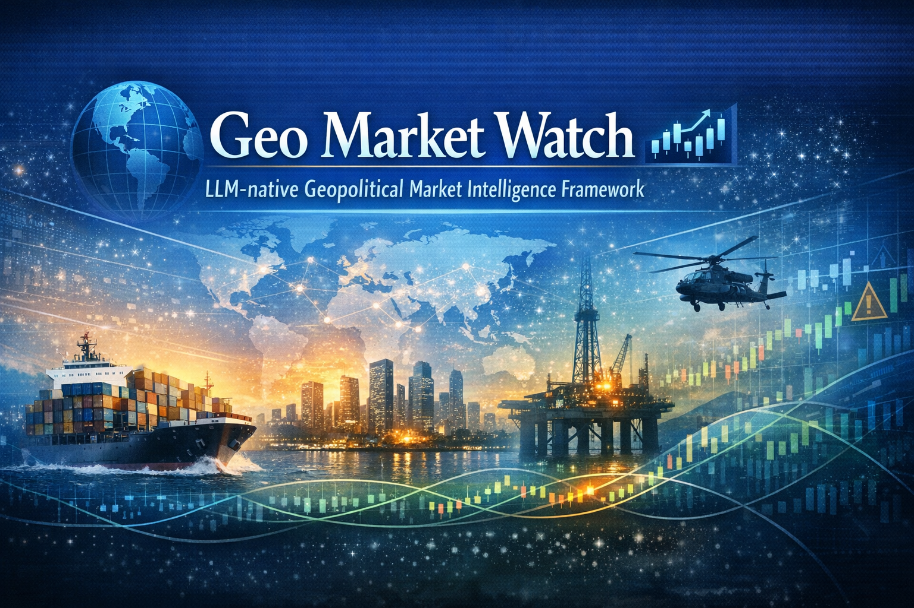
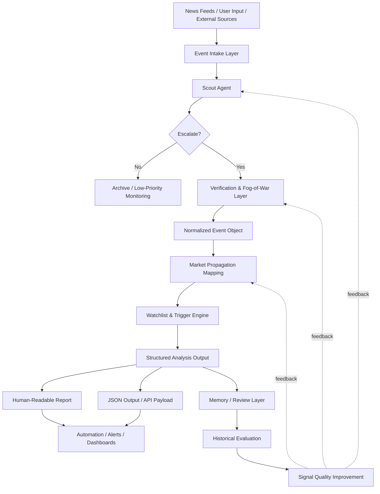

<p align="center">
  
</p>

<h1 align="center">Geo Market Watch 🌍📈</h1>

<p align="center">
  <strong>An LLM-native framework for translating geopolitical events into structured market intelligence.</strong>
</p>

Geo Market Watch converts complex geopolitical developments into structured market observations by combining event normalization, propagation mapping, and trigger-based watchlists.

Instead of producing narrative commentary, the framework focuses on **actionable structure**:

- confirmed facts
- market interpretation
- scenario analysis
- structured watchlists
- observable triggers
- explicit invalidation conditions

The project is designed for analysts, researchers, and developers who want to build **event-driven market intelligence systems** powered by LLMs.

---

## System Evolution Roadmap

Geo Market Watch evolves from a prompt-based monitoring framework into a multi-layer geopolitical intelligence platform.

```
v5 Monitoring Foundation
  Scout → Score → Agent

v6 Intelligence Platform  
  Database → Exposure → Workflow → Performance

v7 Multi-Agent Intelligence (Future)
  Risk Map → Pattern Mining → Strategy Layer
```

**Current Status: v6.4 — Performance-Aware Research Platform**

- ✅ **Monitoring Layer** — Event detection, scoring, agent routing
- ✅ **Intelligence Layer** — Database, exposure mapping, trade ideas
- ✅ **Research Layer** — Analyst review, lifecycle tracking, performance evaluation
- 🔄 **AI Intelligence Layer** — Multi-agent scanning, risk maps, pattern mining (v7+)

**Detailed Architecture:** [docs/system-evolution-architecture.md](docs/system-evolution-architecture.md) | [Institutional Four-Layer View](docs/institutional-system-architecture.md)

---

## Institutional System Architecture

Geo Market Watch evolves from a prompt-based monitoring framework into a layered geopolitical intelligence and research platform.

```
┌──────────────────────────────────────────────┐
│      GEO MARKET WATCH ARCHITECTURE           │
└──────────────────────────────────────────────┘

DATA LAYER
  Raw Signals
    → Event Cards
    → Geo Alpha Database
    → JSON / CSV / Snapshot Exports

AGENT LAYER
  News Intake
    → Dedupe
    → Scoring
    → Trigger
    → Monitoring / Full Analysis Handoff

INTELLIGENCE LAYER
  Event Understanding
    → Sector Exposure
    → Company Exposure
    → Trade Ideas

RESEARCH LAYER
  Analyst Review
    → Approval Workflow
    → Lifecycle Tracking
    → Performance Evaluation
```

**End-to-End Flow:**
```
Signals → Agents → Event Memory → Alpha Mapping → Research Workflow → Performance Feedback
```

**Full Architecture:** [docs/institutional-system-architecture.md](docs/institutional-system-architecture.md)

---

## Framework Overview

Geo Market Watch now operates as a **three-stage analysis system**.

**Stage 1 — Scout Mode**  
Early detection of geopolitical signals.

**Stage 2 — Agent Loop**  
Process, deduplicate, score, and route events.

**Stage 3 — Full Analysis Mode**  
Complete 9-module analysis framework.

**Scout Mode performs:**
- event detection 
- signal scoring 
- escalation checks 

**Agent Loop performs:**
- intake normalization
- event deduplication
- score + trigger evaluation
- notification / handoff

**Full Analysis Mode performs:**
1. Confirmed Facts 
2. Market Interpretation 
3. Scenario Analysis 
4. Supply Chain Translation 
5. Sector Exposure 
6. Watchlist 
7. Trigger Signals 
8. Invalidation Conditions 
9. Monitoring Plan

---

## Quickstart — Geo Alpha Database

Initialize and query the database:

```bash
# Initialize database
python scripts/init_database.py --db data/geo_alpha.db

# Seed with sample events
python scripts/seed_database.py \
  --db data/geo_alpha.db \
  --seed data/db-seed-events.json

# Query recent events
python scripts/query_database.py --db data/geo_alpha.db --list

# Filter by region
python scripts/query_database.py --db data/geo_alpha.db --region "Middle East"

# Show statistics
python scripts/query_database.py --db data/geo_alpha.db --stats
```

---

## Quickstart — Idea Performance Tracking

Start tracking an approved idea:

```bash
python scripts/start_idea_tracking.py \
  --db data/geo_alpha.db \
  --idea-id TRADE_ID \
  --entry-price 72.50 \
  --entry-time 2026-03-15T09:30:00Z
```

Close a tracked idea:

```bash
python scripts/close_trade_idea.py \
  --db data/geo_alpha.db \
  --idea-id TRADE_ID \
  --close-price 79.10 \
  --close-time 2026-03-29T16:00:00Z
```

List tracked ideas:

```bash
python scripts/list_tracked_ideas.py --db data/geo_alpha.db
```

Export performance data:

```bash
python scripts/export_dashboard_data.py \
  --db data/geo_alpha.db \
  --output exports/
```

---

## Quickstart — Minimal Agent Loop

Run the complete v5.5 agent loop:

```bash
python scripts/run_agent_loop.py \
  --input data/intake-sample.json \
  --memory data/dedupe-memory.json \
  --output outputs/
```

This will:
1. Normalize incoming event items
2. Remove duplicates
3. Compute score and trigger results
4. Generate local notification files

---

## Minimal Agent Loop

Starting in v5.5, Geo Market Watch includes a **minimal runnable agent loop**.

**Included nodes:**

- **News intake** — Load and normalize raw event items
- **Event dedupe** — Filter duplicate events using persistent memory
- **Score + trigger** — Compute signal scores and escalation decisions
- **Notify / handoff** — Generate notifications or handoff to full analysis

This is the **first end-to-end executable workflow** in the repository.

It is intentionally:
- **Local** — runs on your machine
- **Deterministic** — same input produces same output
- **Narrow in scope** — validates the loop, not the platform

**What this enables:**
- Run complete monitoring workflow locally
- Test and validate event processing logic
- Generate handoff artifacts for full analysis

**What this does NOT include:**
- Live RSS/API ingestion
- Persistent background scheduler
- Hosted automation service
- Multi-agent orchestration

See [docs/minimal-agent-architecture.md](docs/minimal-agent-architecture.md) for details.

---

## Geo Alpha Database

Starting in v6, Geo Market Watch includes **Geo Alpha Database** — a minimal SQLite-based event storage layer.

**Purpose:**
- Store processed events from the agent loop
- Enable historical event tracking
- Support simple search and filtering
- Provide foundation for future dashboard and analytics

**Features:**
- SQLite database (zero infrastructure)
- 6 tables: events, sources, indicators, flags, notifications, watchlist
- Full CRUD operations
- Query by region, category, band, date
- Statistics and reporting

**What this enables:**
- Persistent event history
- Benchmarkable datasets
- Future dashboard compatibility
- Alpha pattern mining (future)

**What this does NOT include:**
- Production database service
- Web dashboard
- Live hosted API
- Multi-user backend
- Vector/graph database

**Quickstart:**

```bash
# Initialize database
python scripts/init_database.py --db data/geo_alpha.db

# Seed with sample events
python scripts/seed_database.py --db data/geo_alpha.db --seed data/db-seed-events.json

# Query events
python scripts/query_database.py --db data/geo_alpha.db --list

# Show statistics
python scripts/query_database.py --db data/geo_alpha.db --stats
```

See [docs/geo-alpha-database-spec.md](docs/geo-alpha-database-spec.md) for details.

---

## Analyst Review Workflow

Starting in v6.3, Geo Market Watch supports a **full research workflow** with analyst review and lifecycle management for trade ideas.

Automatically generated trade ideas can now be:

- **reviewed by analysts** — approve, reject, monitor, or request revision
- **tracked over time** — full lifecycle from creation to closure
- **invalidated when conditions change** — explicit invalidation with reasons
- **prioritized in dashboards** — approved high-conviction ideas surface first

### Workflow

```
Event Detected
     ↓
Exposure Generated
     ↓
Trade Idea Generated (pending_review)
     ↓
Analyst Review
     ↓
┌─────────────┬─────────────┬─────────────┐
│   Approve   │   Reject    │   Monitor   │
└─────────────┴─────────────┴─────────────┘
     ↓
Lifecycle Tracking
     ↓
Invalidation / Closure
```

### CLI Commands

```bash
# Review a trade idea
python scripts/review_trade_ideas.py \
  --db data/geo_alpha.db \
  --idea-id TRADE_ID \
  --reviewer analyst1 \
  --decision approve \
  --confidence high \
  --notes "Strong thesis, clear invalidation"

# Quick approve
python scripts/approve_trade_idea.py \
  --db data/geo_alpha.db \
  --idea-id TRADE_ID \
  --reviewer analyst1

# Invalidate when conditions change
python scripts/invalidate_trade_idea.py \
  --db data/geo_alpha.db \
  --idea-id TRADE_ID \
  --reason "Shipping traffic normalizing"

# List active approved ideas
python scripts/list_active_ideas.py --db data/geo_alpha.db
```

### Review Quality

- **Reject** and **needs_revision** decisions require notes
- **Approve** and **monitor** decisions accept optional notes
- All decisions are logged for audit and learning

This adds a human review layer to the Geo Alpha Exposure Engine, transforming the system from an idea generator into a structured research workflow.

See [docs/analyst-workflow.md](docs/analyst-workflow.md) for details.

---

## Idea Performance Tracking

Starting in v6.4, Geo Market Watch can track **paper trading performance** for approved trade ideas.

### Features

- **Entry/Close tracking** — Record price references with timestamps
- **Return calculation** — Automatic calculation for long and short ideas
- **Outcome classification** — strong_positive / positive / flat / negative / strong_negative
- **Benchmark comparison** — Track alpha spread vs benchmark
- **Holding period** — Days held calculation
- **Export support** — JSON and CSV export for analysis

### Important Note

This is **paper (hypothetical) tracking only**:
- No actual trades are executed
- No real money is at risk
- For research evaluation only
- Manual price entry required

### CLI Commands

```bash
# Start tracking
python scripts/start_idea_tracking.py \
  --db data/geo_alpha.db \
  --idea-id TRADE_ID \
  --entry-price 72.50 \
  --entry-time 2026-03-15T09:30:00Z

# Close tracking
python scripts/close_trade_idea.py \
  --db data/geo_alpha.db \
  --idea-id TRADE_ID \
  --close-price 79.10 \
  --close-time 2026-03-29T16:00:00Z

# List tracked ideas
python scripts/list_tracked_ideas.py --db data/geo_alpha.db

# Export performance data
python scripts/export_dashboard_data.py \
  --db data/geo_alpha.db \
  --output exports/
```

### Documentation

- [docs/idea-performance-spec.md](docs/idea-performance-spec.md) — Performance tracking specification
- [docs/performance-methodology.md](docs/performance-methodology.md) — Calculation methodology
- [docs/idea-outcome-classification.md](docs/idea-outcome-classification.md) — Outcome classification

---

## Execution Layer

Starting in v5.4, Geo Market Watch includes a **minimal executable engine**.

**v5.5 adds the complete agent loop:**

- **Intake normalizer** — converts raw items to Event Card format
- **Deduplication memory** — prevents duplicate processing
- **Scoring engine** — converts indicators into signal scores (0-10)
- **Trigger engine** — decides whether to escalate to Full Analysis Mode
- **Notifier** — generates monitor/handoff notifications
- **Agent loop** — orchestrates the complete 4-node pipeline

This allows the framework to run an end-to-end workflow:

```
Raw Intake → Normalization → Deduplication → Scoring → Trigger → Notification
```

See [docs/minimal-agent-architecture.md](docs/minimal-agent-architecture.md) for details.

---

# ⚠️ Repository Scope

This repository provides:

- an analytical framework
- structured output schemas
- validation tooling
- workflow examples

It **does not include a built-in monitoring backend or scheduler**.

The framework is intended to be embedded into automation platforms such as:

- workflow orchestration tools
- agent frameworks
- research pipelines
- internal analytics systems

See [docs/scheduled-monitoring.md](docs/scheduled-monitoring.md) for integration examples.

---

# Why Geo Market Watch?

Most geopolitical analysis tools focus on **text generation**.

Geo Market Watch focuses on **structured intelligence generation**.

Instead of producing commentary like:

> "Tensions in the region may affect markets."

The framework produces structured outputs such as:

```
Event
↓
Market Interpretation
↓
Propagation Chain
↓
Watchlist
↓
Trigger Signals
↓
Invalidation Conditions
```

This allows outputs to be used by:

- research teams
- trading workflows
- automated monitoring systems
- dashboards and alerts

---

## System Architecture

The framework is designed as a multi-stage intelligence pipeline.



Detailed architecture: [docs/architecture.md](docs/architecture.md)

Roadmap for the full intelligence system: [docs/roadmap-v6.md](docs/roadmap-v6.md)

---

# Example Analysis Output

Example structured output (simplified):

```json
{
  "event": {
    "title": "Red Sea shipping disruption risk rises",
    "event_type": "shipping_disruption"
  },
  "confirmed_facts": [
    "Shipping risk in the Red Sea has increased",
    "Operators are reassessing transit exposure"
  ],
  "market_interpretation": [
    "Potential rerouting increases shipping duration and cost"
  ],
  "watchlist": [
    {
      "ticker": "MAERSK-B.CO",
      "trigger": "Freight indicators remain elevated for several days",
      "invalidation": "Transit conditions normalize quickly"
    }
  ]
}
```

Full example files: [examples/schema-examples/](examples/schema-examples/)

---

## Project Structure

```
geo-market-watch/
│
├── agents/
│   ├── openai.yaml
│   └── minimal-agent-config.example.json
│
├── data/
│   ├── benchmark-events.json
│   ├── intake-sample.json
│   ├── dedupe-memory.sample.json
│   ├── db-seed-events.json
│   ├── geo_alpha.db
│   └── idea-performance-sample.json
│
├── docs/
│   ├── scout-mode-example.md
│   ├── event-card-schema.md
│   ├── signal-scoring.md
│   ├── scoring-engine-spec.md
│   ├── full-analysis-trigger.md
│   ├── event-database-design.md
│   ├── minimal-agent-architecture.md
│   ├── notification-spec.md
│   ├── geo-alpha-database-spec.md
│   ├── database-query-examples.md
│   ├── benchmark-v5.md
│   ├── benchmark-v5.4.md
│   ├── benchmark-v5.5.md
│   ├── benchmark-v6.md
│   ├── scheduled-monitoring.md
│   ├── analyst-workflow.md
│   ├── idea-lifecycle-spec.md
│   ├── analyst-review-guidelines.md
│   ├── benchmark-v6.3.md
│   ├── idea-performance-spec.md
│   ├── performance-methodology.md
│   ├── idea-outcome-classification.md
│   ├── benchmark-v6.4.md
│   ├── system-evolution-architecture.md
│   └── institutional-system-architecture.md
│
├── engine/
│   ├── scoring_engine.py
│   ├── trigger_engine.py
│   ├── intake_normalizer.py
│   ├── dedupe_memory.py
│   ├── notifier.py
│   ├── agent_loop.py
│   ├── database_models.py
│   ├── database.py
│   ├── artifact_ingest.py
│   ├── exposure_engine.py
│   ├── status_rules.py
│   ├── idea_review_engine.py
│   ├── lifecycle_engine.py
│   ├── performance_engine.py
│   ├── export_layer.py
│   └── dashboard_views.py
│
├── examples/
│   ├── intake-input.example.json
│   ├── notify-monitor.example.md
│   ├── notify-full-analysis.example.md
│   ├── database-query-output.example.md
│   ├── idea-performance.example.json
│   └── idea-performance-output.example.md
│
├── prompts/
│   └── scout-mode.md
│
├── scripts/
│   ├── run_benchmark.py
│   ├── run_agent_loop.py
│   ├── init_database.py
│   ├── seed_database.py
│   ├── query_database.py
│   ├── ingest_artifacts.py
│   ├── review_trade_ideas.py
│   ├── approve_trade_idea.py
│   ├── invalidate_trade_idea.py
│   ├── list_active_ideas.py
│   ├── start_idea_tracking.py
│   ├── close_trade_idea.py
│   ├── update_idea_price_reference.py
│   ├── list_tracked_ideas.py
│   └── export_dashboard_data.py
│
├── CHANGELOG.md
├── README.md
└── SKILL.md
```

---

## Documentation

Key framework documents:

**Scout Mode**  
[docs/scout-mode-example.md](docs/scout-mode-example.md)

**Event Card Schema**  
[docs/event-card-schema.md](docs/event-card-schema.md)

**Signal Scoring Framework**  
[docs/signal-scoring.md](docs/signal-scoring.md)

**Scoring Engine Specification**  
[docs/scoring-engine-spec.md](docs/scoring-engine-spec.md)

**Full Analysis Triggers**  
[docs/full-analysis-trigger.md](docs/full-analysis-trigger.md)

**Event Database Design**  
[docs/event-database-design.md](docs/event-database-design.md)

**Benchmark Comparison (v5)**  
[docs/benchmark-v5.md](docs/benchmark-v5.md)

**Benchmark Validation (v5.4)**  
[docs/benchmark-v5.4.md](docs/benchmark-v5.4.md)

**Agent Loop Benchmark (v5.5)**  
[docs/benchmark-v5.5.md](docs/benchmark-v5.5.md)

**Minimal Agent Architecture**  
[docs/minimal-agent-architecture.md](docs/minimal-agent-architecture.md)

**Notification Specification**  
[docs/notification-spec.md](docs/notification-spec.md)

**Geo Alpha Database Spec**  
[docs/geo-alpha-database-spec.md](docs/geo-alpha-database-spec.md)

**Database Query Examples**  
[docs/database-query-examples.md](docs/database-query-examples.md)

**Engine Documentation**  
[engine/README.md](engine/README.md)

**Scheduled Monitoring Guide**  
[docs/scheduled-monitoring.md](docs/scheduled-monitoring.md)

**Analyst Workflow (v6.3)**  
[docs/analyst-workflow.md](docs/analyst-workflow.md)

**Idea Lifecycle Spec (v6.3)**  
[docs/idea-lifecycle-spec.md](docs/idea-lifecycle-spec.md)

**Idea Performance Spec (v6.4)**  
[docs/idea-performance-spec.md](docs/idea-performance-spec.md)

**Performance Methodology (v6.4)**  
[docs/performance-methodology.md](docs/performance-methodology.md)

**System Evolution Architecture**  
[docs/system-evolution-architecture.md](docs/system-evolution-architecture.md)

**Institutional System Architecture**  
[docs/institutional-system-architecture.md](docs/institutional-system-architecture.md)

**Example Intake Input**  
[examples/intake-input.example.json](examples/intake-input.example.json)

**Example Monitor Notification**  
[examples/notify-monitor.example.md](examples/notify-monitor.example.md)

**Example Full Analysis Handoff**  
[examples/notify-full-analysis.example.md](examples/notify-full-analysis.example.md)

**Example Performance Output**  
[examples/idea-performance-output.example.md](examples/idea-performance-output.example.md)

---

# Core Data Schemas

The framework relies on JSON schemas to define the intelligence data contract.

## Event Object

Defines normalized geopolitical events.

**File:** [schemas/event-object.json](schemas/event-object.json)

Contains:
- actors
- geographies
- sources
- event type
- confidence level
- contradictions

---

## Watchlist Item

Defines structured market observation targets.

**File:** [schemas/watchlist-item.json](schemas/watchlist-item.json)

Each item contains:
- asset / ticker
- thesis
- physical mapping node
- trigger signals
- invalidation conditions
- time horizon

---

## Analysis Output

Defines the complete analysis artifact.

**File:** [schemas/analysis-output.json](schemas/analysis-output.json)

Includes:
- event object
- confirmed facts
- market interpretation
- scenario analysis
- watchlist
- propagation chain

---

# Quick Start

Clone the repository:

```bash
git clone https://github.com/foreverpupu/geo-market-watch.git
cd geo-market-watch
```

Install schema validation dependencies:

```bash
pip install -r tests/schema_validation/requirements.txt
```

Run schema validation:

```bash
python tests/schema_validation/validate_examples.py
```

Expected output:

```
Passed: 3/3
Failed: 0/3
```

---

# Methodology

The Geo Market Watch methodology is based on several analytical principles:

## Event-Driven Analysis

The system centers analysis around **events**, not articles.

---

## Fact vs Interpretation Separation

Outputs explicitly separate:
- **confirmed facts**
- **interpretation**
- **scenarios**

---

## Propagation Mapping

Geopolitical shocks are translated into economic propagation chains.

**Example:**

```
Red Sea disruption
        ↓
Longer shipping routes
        ↓
Higher freight costs
        ↓
Logistics equity exposure
```

---

## Trigger-Based Monitoring

Each watchlist item must include:
- **observable trigger signals**
- **explicit invalidation conditions**

This prevents vague analysis and encourages disciplined monitoring.

---

# Validation

The repository includes schema validation tooling.

**Validation script:**

```
tests/schema_validation/validate_examples.py
```

**Validation checks:**
- schema correctness
- example JSON compatibility
- cross-schema references

CI automatically runs validation on every pull request.

---

# Contributing

Contributions are welcome.

Please read [CONTRIBUTING.md](CONTRIBUTING.md) before submitting changes.

**Typical contributions include:**
- documentation improvements
- schema improvements
- example scenarios
- tooling enhancements

---

# Roadmap

See [docs/roadmap-v6.md](docs/roadmap-v6.md)

**Future directions include:**
- multi-agent intelligence pipeline
- propagation graph modeling
- event memory and review
- signal quality evaluation
- automated monitoring integration

---

## Example Workflow

**Input**

News headline:

> "Houthi attacks force shipping firms to reroute vessels"

**Scout Mode Output**

Event Card generated

Signal Score: **6**

Status: **Monitoring**

If score ≥7:

**Full Analysis Mode** is triggered.

Full analysis produces:
- sector exposure 
- trade watchlist 
- invalidation conditions

---

## License

Geo Market Watch is released under a **custom non-commercial research license**.

You may:

- Use the framework for personal research 
- Modify the framework for private use 
- Apply the methodology for investment analysis 

You may NOT:

- Use the project in commercial products 
- Repackage or resell the framework 
- Distribute modified versions for commercial purposes 

See `LICENSE.md` for full terms.

---

# Acknowledgment

Geo Market Watch is an experimental framework exploring how LLMs can support structured geopolitical intelligence.

The project aims to bridge the gap between:
- **narrative geopolitical analysis**
- **structured market monitoring systems**
