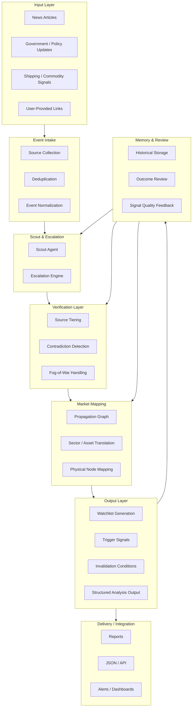

# Geo Market Watch Architecture

This document describes the high-level system architecture of Geo Market Watch
v6.

The architecture is designed to transform geopolitical events into structured
market intelligence signals.

---

# System Overview

The Geo Market Watch system consists of six logical layers.



Each layer performs a specialized function in the intelligence pipeline.

---

# Layer 1 — Event Intake

The Event Intake Layer collects raw inputs from multiple sources.

Possible sources include:

- news articles
- government announcements
- sanction lists
- commodity market reports
- shipping updates
- social media signals

The purpose is to normalize incoming information into a consistent structure.

Example Event Object:
```
event_id
timestamp
location
actors
event_type
source
confidence
raw_input
```

---

# Layer 2 — Scout Agent

The Scout Agent performs rapid scanning and determines whether an event
should be escalated for deeper analysis.

Responsibilities:

- summarize the event
- estimate credibility
- identify potential market domains
- assign escalation score

Output example:
```
event_summary
confidence_level
market_domains
escalation_score
recommendation
```

---

# Layer 3 — Verification Layer

This layer evaluates the credibility of the event.

Key tasks:

- compare multiple sources
- detect contradictions
- evaluate source tiers
- determine confidence level

If the information environment is unstable, the system activates
**Fog-of-War mode**.

---

# Layer 4 — Market Propagation Graph

This layer maps geopolitical events to economic and market consequences.

Propagation nodes include:

- geography
- commodities
- logistics infrastructure
- supply chains
- industry sectors
- financial instruments

Example propagation chain:
```
Sanction on metal exports
↓
Global supply tightening
↓
Commodity price increase
↓
Mining company benefit
```

---

# Layer 5 — Watchlist Engine

The Watchlist Engine converts propagation insights into structured
observation targets.

Each watchlist item includes:

- ticker
- asset name
- thesis
- trigger signal
- invalidation condition
- time horizon
- confidence level

---

# Layer 6 — Memory & Review

The final layer stores historical analyses and outcomes.

Recorded information includes:

- event data
- propagation logic
- watchlists
- triggers
- invalidations
- later outcomes

This enables retrospective evaluation and model improvement.

---

# Agent Collaboration Model

The system relies on multiple specialized agents.

```
Scout Agent
↓
Verification Agent
↓
Mapping Agent
↓
Watchlist Agent
```

Each agent focuses on a specific analytical responsibility.

---

# Structured Output

All deep analysis results follow a standardized structure.

Required sections:

- Confirmed Facts
- Market Interpretation
- Scenario Analysis
- Watchlist
- Trigger Signals
- Invalidation Conditions

Additionally, the system can produce machine-readable JSON outputs
for integration with automation tools.

---

# Integration Layer

Geo Market Watch does not implement scheduling internally.

Instead it integrates with external automation platforms such as:

- workflow automation tools
- agent orchestration frameworks
- notification systems

These tools handle:

- scheduling
- data ingestion
- alert delivery
