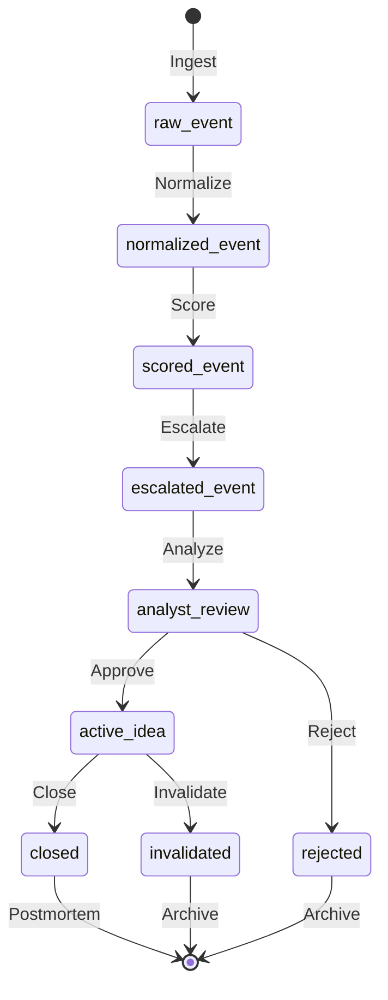

# Event State Machine

## Overview

Geo Market Watch processes events through a deterministic state machine, from raw input to final resolution.

---

## Event Lifecycle

```
raw_event
    ↓
normalized_event
    ↓
scored_event
    ↓
escalated_event
    ↓
analyst_review
    ↓
active_idea
    ↓
invalidated / closed
```

---

## State Definitions

### 1. raw_event
**Input:** Unstructured geopolitical signal

**Characteristics:**
- Headline text
- Source URL
- Timestamp
- Optional: summary, region, category

**Example:**
```json
{
  "headline": "Red Sea shipping disruption escalates",
  "source": "Financial Times",
  "timestamp": "2026-03-15T08:00:00Z"
}
```

**Transitions:**
- `normalize()` → normalized_event

---

### 2. normalized_event
**Output:** Structured event card

**Characteristics:**
- Schema-validated
- Required fields populated
- Category assigned
- Region identified

**Example:**
```json
{
  "event_id": "evt_001",
  "headline": "Red Sea shipping disruption escalates",
  "summary": "Major carriers reroute around Africa",
  "region": "Middle East",
  "category": "shipping",
  "severity": "high",
  "timestamp": "2026-03-15T08:00:00Z"
}
```

**Transitions:**
- `check_duplicate()` → scored_event (if new)
- `check_duplicate()` → duplicate (if exists)

---

### 3. scored_event
**Output:** Event with impact score

**Characteristics:**
- Score: 0-10
- Band: low/medium/high/critical
- Score breakdown available

**Example:**
```json
{
  "event_id": "evt_001",
  "score": {
    "value": 8,
    "band": "high",
    "breakdown": {
      "severity": 3,
      "scope": 3,
      "immediacy": 2
    }
  }
}
```

**Transitions:**
- `evaluate_trigger()` → escalated_event (if score >= 7)
- `evaluate_trigger()` → monitored_event (if score < 7)

---

### 4. escalated_event
**Output:** Event flagged for full analysis

**Characteristics:**
- Escalation decision: "full_analysis"
- Rationale recorded
- Analysis triggered

**Example:**
```json
{
  "event_id": "evt_001",
  "escalation": {
    "decision": "full_analysis",
    "rationale": "Supply chain disruption with clear market transmission",
    "triggered_at": "2026-03-15T08:00:02Z"
  }
}
```

**Transitions:**
- `generate_analysis()` → analyst_review

---

### 5. analyst_review
**Output:** Analysis awaiting human review

**Characteristics:**
- Full analysis artifact generated
- Trade ideas proposed
- Watchlist items identified
- Pending analyst decision

**Example:**
```json
{
  "event_id": "evt_001",
  "analysis": {
    "sectors": ["shipping", "energy"],
    "trade_ideas": [...],
    "watchlist": [...]
  },
  "review_status": "pending",
  "assigned_analyst": null
}
```

**Transitions:**
- `analyst_approve()` → active_idea
- `analyst_reject()` → rejected
- `analyst_monitor()` → monitoring

---

### 6. active_idea
**Output:** Approved trade idea being tracked

**Characteristics:**
- Analyst approved
- Entry price recorded
- Invalidation conditions set
- Performance tracked

**Example:**
```json
{
  "trade_idea_id": "idea_001",
  "event_id": "evt_001",
  "status": "active",
  "approval": {
    "analyst": "amy",
    "decision": "approve",
    "timestamp": "2026-03-15T10:00:00Z"
  },
  "tracking": {
    "entry_price": 100.0,
    "entry_time": "2026-03-15T09:30:00Z"
  }
}
```

**Transitions:**
- `close_tracking()` → closed
- `invalidate()` → invalidated
- `update()` → active_idea (modified)

---

### 7. invalidated
**Terminal State:** Idea no longer valid

**Characteristics:**
- Invalidation reason recorded
- Lifecycle event logged
- Performance calculated (if tracked)

**Example:**
```json
{
  "trade_idea_id": "idea_001",
  "status": "invalidated",
  "invalidation": {
    "reason": "Route reopened earlier than expected",
    "invalidated_at": "2026-03-20T14:00:00Z",
    "invalidated_by": "system"
  }
}
```

**Transitions:** None (terminal)

---

### 8. closed
**Terminal State:** Idea completed

**Characteristics:**
- Close price recorded
- Return calculated
- Outcome classified
- Postmortem scheduled

**Example:**
```json
{
  "trade_idea_id": "idea_001",
  "status": "closed",
  "close": {
    "price": 115.0,
    "time": "2026-03-29T16:00:00Z",
    "return_pct": 15.0,
    "outcome": "strong_positive"
  }
}
```

**Transitions:**
- `schedule_postmortem()` → postmortem_pending

---

## State Transitions Summary

| From | To | Trigger | Actor |
|------|-----|---------|-------|
| raw_event | normalized_event | normalize() | System |
| normalized_event | scored_event | score() | System |
| scored_event | escalated_event | escalate() | System |
| escalated_event | analyst_review | analyze() | System |
| analyst_review | active_idea | approve() | Analyst |
| analyst_review | rejected | reject() | Analyst |
| active_idea | closed | close() | Analyst/System |
| active_idea | invalidated | invalidate() | Analyst/System |
| closed | postmortem | schedule() | System |

---

## Error States

### duplicate
Event matches existing event in dedupe memory.

**Resolution:** Skip processing, log reference to original.

### failed_normalization
Event cannot be normalized (missing required fields).

**Resolution:** Log error, notify operator, quarantine event.

### failed_scoring
Score calculation error.

**Resolution:** Log error, use default score, flag for review.

---

## Implementation Notes

### Database Schema

```sql
-- Events table tracks state
create table events (
    event_id text primary key,
    state text not null,  -- current state
    state_history text,   -- JSON array of state transitions
    created_at text,
    updated_at text
);

-- State transitions logged
create table state_transitions (
    transition_id text primary key,
    event_id text references events(event_id),
    from_state text,
    to_state text,
    triggered_by text,  -- function or user
    timestamp text
);
```

### Validation Rules

1. **Valid Transitions Only** — Reject invalid state changes
2. **Timestamp Ordering** — Ensure chronological transitions
3. **Actor Logging** — Record who/what triggered change
4. **Idempotency** — Same input → same state

---

## Visualization



---

See [Idea Lifecycle Spec](../operations/idea-lifecycle-spec.md) for trade idea state details.
